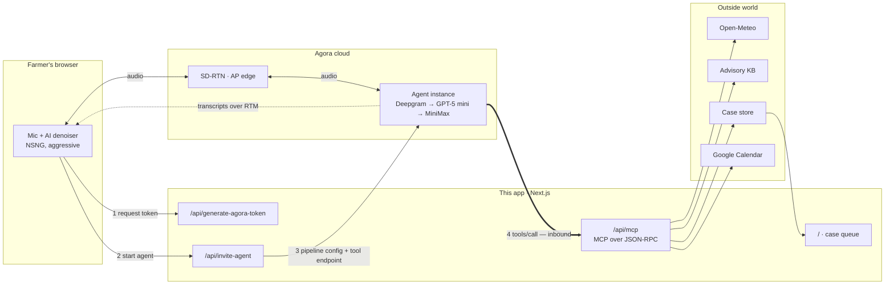

# किसान साथी · Kisan Saathi

A Hindi-first voice agent that triages crop problems for Indian farmers — and
hands the ones it isn't sure about to a human agronomist, with the whole
conversation already written down.

Built on the [Agora Conversational AI Engine](https://docs.agora.io/en/conversational-ai/overview/product-overview).

---

## The problem

An agronomist in India serves roughly a thousand farmers. A farmer who notices
black spots on his tomato leaves has three options: guess, ask a neighbour, or
ask the shopkeeper selling him the pesticide. All three are how a crop gets
lost, and the third has a conflict of interest.

The obvious fix — an app — fails on contact with the field. It assumes literacy,
a smartphone, data, and English or at least typed Hindi. The farmer who most
needs help is the least likely to have all four.

He can talk, though. Everyone can talk.

## What it does

Kisan Saathi answers in Hindi, English, or the mix people actually speak. It
does not diagnose on the first turn. It asks the questions an agronomist would
ask, checks real data, and when it isn't confident it says so, writes up a
structured case, books a callback, and gets out of the way.

A real exchange from testing:

> **Farmer:** नमस्ते, मैं नासिक से रमेश बोल रहा हूँ। मेरे टमाटर के पत्तों पर काले धब्बे हैं
> और सुबह नीचे सफेद फफूंद दिखती है। चार दिन से है और तेजी से फैल रहा है।
>
> **Agent:** एक सेकंड, मैं देखता हूँ।
> *(calls `get_weather` → Nashik, 27.5°C, 72% humidity, 10.8mm rain in three days)*
> *(calls `search_advisory` → late blight, early blight, leaf curl — flagged as a weak match)*
>
> **Agent:** क्या वह सफेद फफूंद पत्ते की निचली सतह पर बनती है?

That last question isn't improvised. It's the one question in the knowledge base
that separates late blight from early blight — the tool returns the question,
not the answer, precisely so the agent asks instead of guessing.

Ask it for a pesticide dose and it refuses, every time, and offers an expert
instead. The knowledge base contains no doses at all, so there is nothing for it
to leak.

## Architecture



**The counterintuitive part is arrow 4.** Everything else flows outward from the
browser, but tool calls arrive *inbound*: Agora's cloud calls this app. That's
why the MCP endpoint must be publicly reachable — `localhost` is invisible to
it — and why a tunnel or deployment is mandatory rather than convenient.

The second thing worth knowing: **once the call is live, this app is idle.**
Speech recognition, the language model and speech synthesis all run in Agora's
cloud. The server only mints a token, posts a config, and answers tool calls.

An interactive version of these diagrams, including the case-handover flow,
lives at [`/tech`](http://localhost:3000/tech) in the running app.

## How Agora Conversational AI is used

| Feature | How | Why it matters here |
|---|---|---|
| `Agent` + `AgentSession` | `agora-agents` SDK, config built per call in [`invite-agent`](app/api/invite-agent/route.ts) | Config lives in git and is reviewable, rather than in a console |
| `llm.mcp_servers` | Streamable-HTTP MCP server at [`/api/mcp`](app/api/mcp/route.ts), five tools, explicit allowlist | The agent acts, not just talks |
| `sal.sal_mode: locking` | Selective Attention Locking | Blocks ~95% of other voices and ambient noise. A field is not a quiet room |
| `turn_detection.end_of_speech: semantic` | With `pause_state_enabled` | A farmer pausing to look at a leaf isn't finished talking. A fixed silence timer cuts him off |
| `interruption` | `start_of_speech` plus Hindi keyword triggers | Barge-in still works when the noise floor confuses voice detection |
| `filler_words` | Hindi phrases after 700ms | Silence on a rural line reads as a dropped call |
| `parameters.silence_config` | 20s, speaks a Hindi re-prompt | Re-engages instead of sitting mute |
| `advancedFeatures.enable_rtm` | Live transcripts to the browser | Powers the on-screen transcript |
| `Area.AP` | Asia-Pacific region | Media stays in-region for Indian callers |
| `agentManagement.agentThink` | Used in testing to inject turns | Let the conversation be tested without a microphone |

## Services and models

| Layer | Provider | Notes |
|---|---|---|
| Speech recognition | Deepgram `nova-3`, `language: multi` | One stream carries Hindi and English, including mid-sentence switching |
| Reasoning | OpenAI `gpt-5-mini`, `reasoning_effort: low` | Tool-calling reliability without the latency (see Gotchas) |
| Speech synthesis | MiniMax `speech-2.6-turbo` | Four voices, three Hindi — selectable in the call panel |
| Real-time transport | Agora SD-RTN | AP edge |
| Noise suppression | `agora-extension-ai-denoiser` | Neural NSNG model, client-side |
| Weather | [Open-Meteo](https://open-meteo.com) | No API key, no signup |
| Crop advisory | Local curated KB | 8 conditions across tomato, cotton, wheat, paddy |
| Appointments | Google Calendar | Apps Script webhook, plus a always-generated add-to-calendar link |
| Case register | Google Sheets *(optional)* | Apps Script webhook |

All speech and LLM services run under **Agora Managed Keys** — no vendor API
keys are required to run this project.

## Conversational capabilities

1. **Code-switching** — Hindi, English, or both in one sentence, with replies in
   Devanagari so the Hindi voice pronounces them as Hindi
2. **Barge-in** — start-of-speech interruption plus keyword triggers
3. **Natural turn-taking** — semantic end-of-speech with pause-intent detection
4. **Noise handling** — speaker locking, tuned VAD thresholds, client-side neural denoising
5. **Recovery from corrections** — a correction replaces the old fact outright, is confirmed back, and anything already looked up with the wrong fact is redone
6. **Session memory** — 40 turns; the agent never re-asks what it was told
7. **Dynamic questioning** — the next question comes from the knowledge base's differential, not a script
8. **Uncertainty** — confidence is stated aloud and travels with the case
9. **Escalation** — to a human, with a booked time

## External actions

When the agent decides a case needs a human, it acts outside the conversation:

- **`create_case`** — writes a 12-field structured record: crop, symptoms in the
  farmer's own words, duration, area, spread, prior treatment, hypothesis,
  its own confidence, weather at the time, language spoken
- **`escalate_to_expert`** — marks urgency and reason
- **`book_expert_callback`** — books a slot (urgent: within two hours inside
  working hours; routine: next morning), creates a **Google Calendar event**,
  and returns a time the agent says aloud: *"कल सुबह दस बजे"*
- **Google Sheets** — appends the case to a shared cooperative register

The farmer hears a case number, read digit by digit so he can write it on his
hand. The agronomist opens a filled-in record — never a voicemail.

## Safety

- **No pesticide doses, ever.** Not in the prompt, not in the knowledge base.
  The one thing that could physically hurt someone is structurally absent
- **Honest uncertainty.** Weak knowledge-base matches are flagged as weak, and
  the agent's confidence is passed to the expert unedited
- **Medical emergencies override everything.** Pesticide ingestion gets
  "reach a doctor now", not a crop question — verified in testing
- **Scope is enforced.** Off-topic questions get one short refusal. Attempts to
  change its role or extract its instructions are refused without leaking
- **Never claims to be human**
- **Human has the last word** — an agronomist resolves cases; the agent cannot

## Known limitations

- **Four crops.** Anything outside tomato, cotton, wheat and paddy is escalated
  rather than guessed at — correct behaviour, but narrow coverage
- **No phone line.** The design assumes a farmer on a feature phone; connecting
  a real number needs telephony provisioning that was out of scope for this
  build. Everything upstream of the phone leg is done
- **Speech recognition degrades** in heavy field noise and on weak connections,
  denoising notwithstanding
- **Place names must be romanised** for the weather lookup. The model handles
  this; a transliteration fallback catches it when it doesn't, and flags the
  match as approximate
- **Case store is a JSON file locally.** Redis is used when configured, but
  there is no multi-writer locking — fine at demo scale, not at cooperative scale
- **Advisory content is curated by hand**, not sourced from a live agricultural
  database, and is not a substitute for an agronomist

## Running it

Requires Node 24 (`.nvmrc`), pnpm, and an Agora project with Conversational AI
enabled.

```bash
pnpm install
cp env.local.example .env.local   # add NEXT_PUBLIC_AGORA_APP_ID and NEXT_AGORA_APP_CERTIFICATE
```

Tools are called by Agora's cloud, so the app needs a public URL:

```bash
cloudflared tunnel --url http://localhost:3000
echo 'MCP_PUBLIC_URL=https://<your-tunnel>.trycloudflare.com' >> .env.local
pnpm dev
```

Check everything is wired before you rely on it:

```bash
curl -s http://localhost:3000/api/health | python3 -m json.tool
```

`ready` and `mcpReachable` must both be true. `mcpReachable` calls our own
public URL and returns through the tunnel — if that round trip works, Agora can
reach the tools too.

| Route | What it is |
|---|---|
| `/` | Agronomist case queue, with the call panel |
| `/tech` | How it works, for non-technical readers |
| `/talk` | Farmer conversation on its own |
| `/api/health` | Configuration and reachability check |

Optional: `SHEETS_WEBHOOK_URL`, `CALENDAR_WEBHOOK_URL` (Google Apps Script web
apps), `NEXT_TTS_VOICE_ID`, and `UPSTASH_REDIS_REST_URL` / `_TOKEN` for durable
cases.

## Demo

1. Open `/` — three cases in the queue, one urgent
2. **Call the agent**, choose a voice, describe a tomato problem in Hindi
3. Interrupt it mid-sentence — it stops and listens
4. Correct a fact you gave earlier — it takes the correction and re-checks
5. Ask for a pesticide dose — it refuses and offers an expert
6. Watch the case appear in the queue *behind the call window*, live
7. Open the case: everything said, plus the agent's confidence and the booked
   callback

## Gotchas worth knowing

Two bugs found the hard way, both documented in the code:

- **GPT-5 rejects GPT-4 parameters.** `max_tokens`, `temperature` and `top_p`
  return a 400 on every turn. Because the greeting is a static string, the agent
  *appears* healthy while every real reply silently fails
- **GPT-5 reasons before answering** — 6.9s to first token, unusable on a call.
  `reasoning_effort: 'low'` brings it to ~0.86s while keeping tool-calling reliable

## Future

The phone line first — a real number is the whole accessibility argument, and
everything behind it already works. Then outbound calls, so the agronomist
returns the call from the queue. Then more crops, and mandi prices and scheme
eligibility as real tools rather than honest refusals. Cross-session memory
would let a returning farmer skip the basics; voiceprint recognition
(`sal_mode: recognition`) would let a cooperative know who is calling.

---

Built on the [Agora Conversational AI Next.js quickstart](https://github.com/AgoraIO-Conversational-AI/agent-quickstart-nextjs).
MIT licensed.
